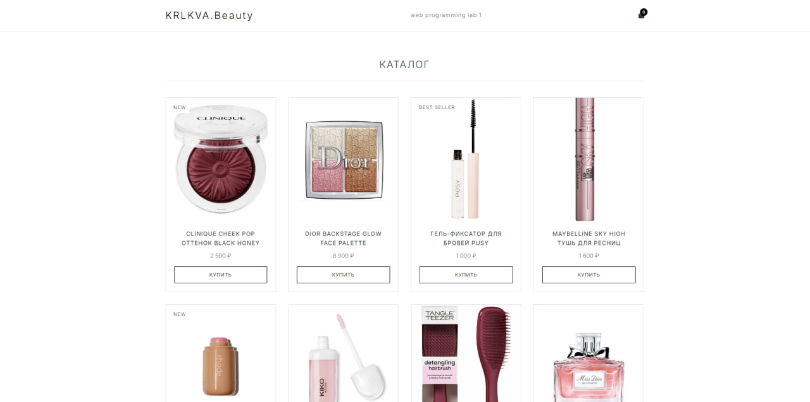
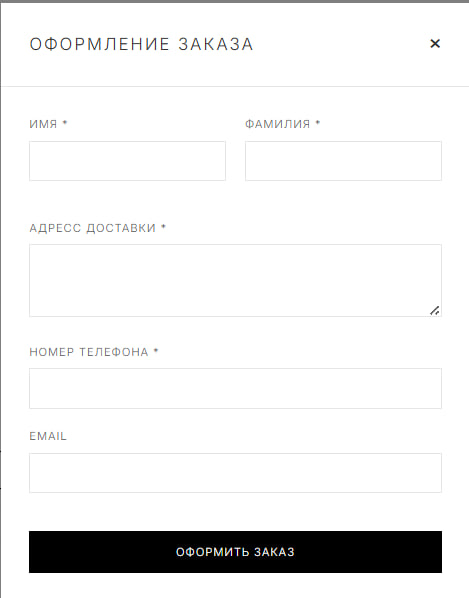
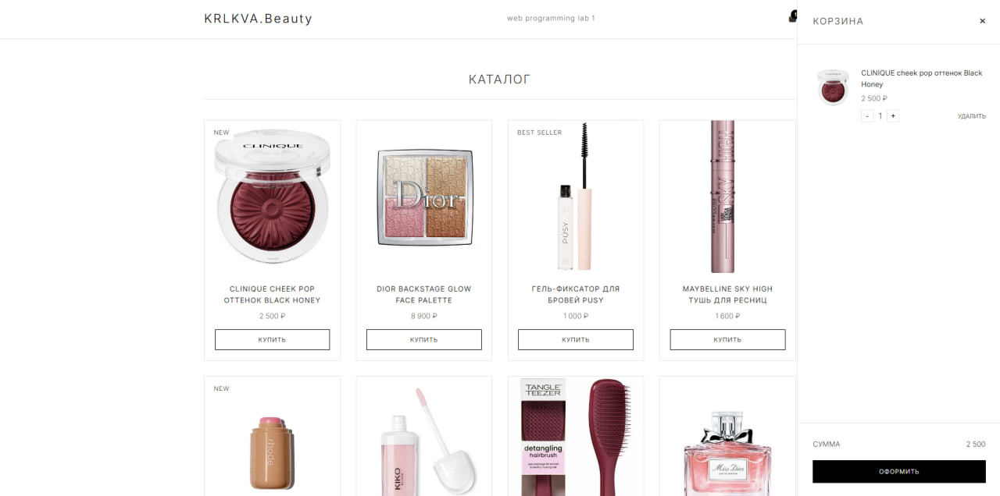
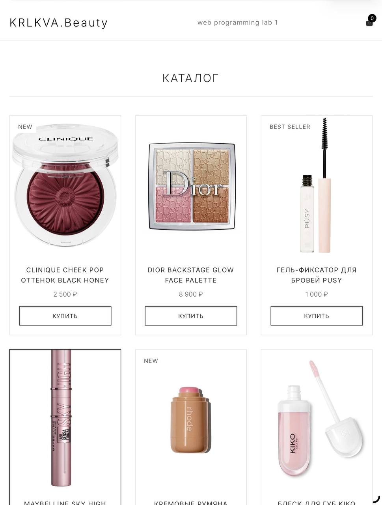
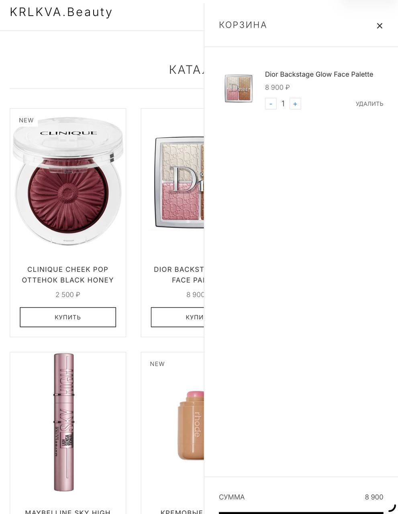
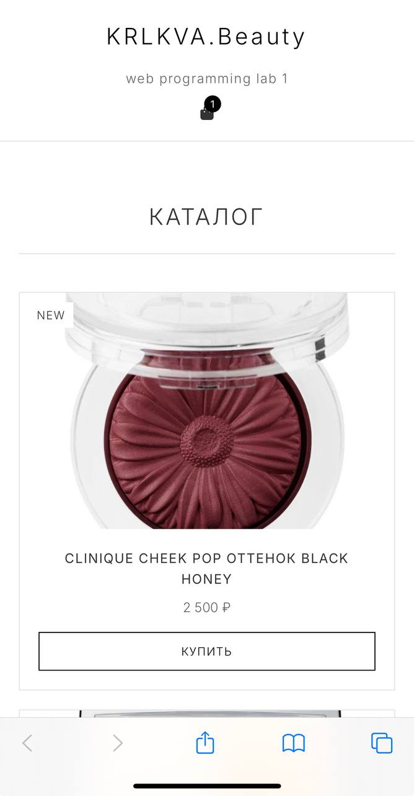
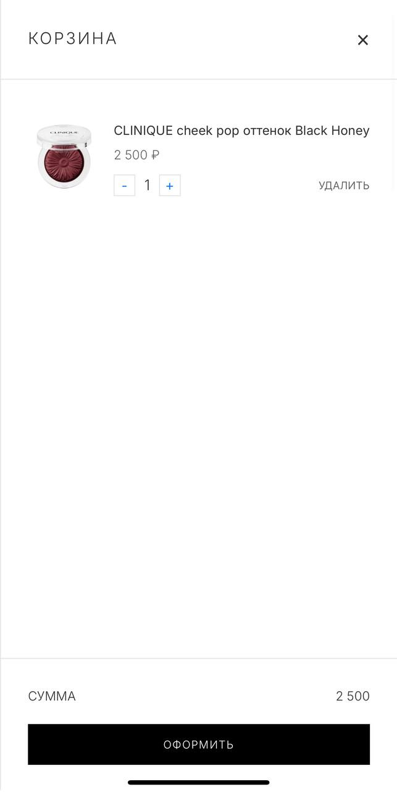

# web-lab1
# Интернет-магазин

[Деплой](https://krlkva.github.io/web-lab1/)

В рамках данной работы я разработала интернет-магазин с каталогом товаров и функционалом корзины.

В работе был использован чистый javascript + html и css

## Требования к работе

### Макет и верстка
1. Создана HTML-страница магазина с карточками товаров, названием, ценой и кнопками «Добавить в корзину».

3. Использована семантическая разметка.

Семантическую разметку можно рассмотреть в html-файле

3. Форма содержит все обязательные поля: имя, фамилия, адрес доставки, контактный номер телефона и кнопку «Создать заказ».

### Адаптивность

1. Сайт корректно отображается на ноутбуке и планшете.

3. Сайт корректно отображается на телефоне

### Логика корзины
1. Реализация добавления товара в корзину при нажатии на кнопку.
2. Реализация удаления товара из корзины.
3. Изменение количества товара в корзине с автоматическим пересчетом суммы.
4. Сохранение корзины в localStorage при обновлении страницы
5. Корректное отображение итоговой суммы при изменении корзины.

### Форма заказа
1. Форма открывается при нажатии на кнопку «Оформить заказ»
2. После заполнения всех полей и нажатия «Создать заказ» появляется сообщение «Заказ создан!»

[Видео с работоспособностью сайта]([https://krlkva.github.io/web-lab1/](https://disk.yandex.ru/i/Rk9GQtn2aXLHIA))
